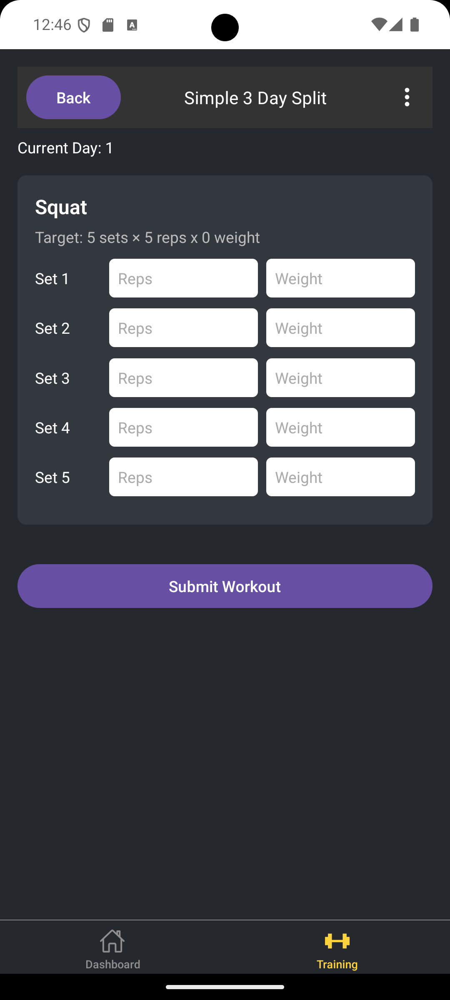

# Fitness App 

Just a basic starter React Native app built with expo for creating training programs, exercises and tracking workouts.

---

##  Features

- User registration and login
- Token-based authentication along with refresh token
- Workout tracking

---

## Preview

### Create Program Flow
<video src="assets/createflow-2x.mp4" width="320" autoplay loop muted controls></video>
[Watch demo on Youtube]([Watch demo on YouTube](https://youtu.be/3mwuLC7Ln_M?si=qT2uUxDNy3pmunlj))

### Dashboard
<video src="assets/dashboard-2x.mp4" width="320" autoplay loop muted controls></video>
[Watch demo on Youtube]([Watch demo on YouTube](https://youtu.be/Cb_PgN6viSA?si=1dkG9obLdrnQ6An3))
###  Screenshots

<table>
  <tr>
    <td></td>
    <td></td>
    <td></td>
  </tr>
</table>

---

##  To try out:

1. Clone this repo and the [back-end]()

   ```bash
   git clone https://github.com/Dagr02/fitness-app-mobile
   cd fitness-app-mobile

2. Make sure you have nodejs, then install dependancies:
   ```bash
   npm install

3. Start the development server:
   ```bash
   npx expo start

4. Launch the app via [Android Studio Emulator](https://developer.android.com/studio) or your physical device using [Expo Go](https://expo.dev/go)


### Prerequisites

- Make sure to have Node-Js and Expo CLI installed. 
   ```bash
   npm install -g expo-cli


---